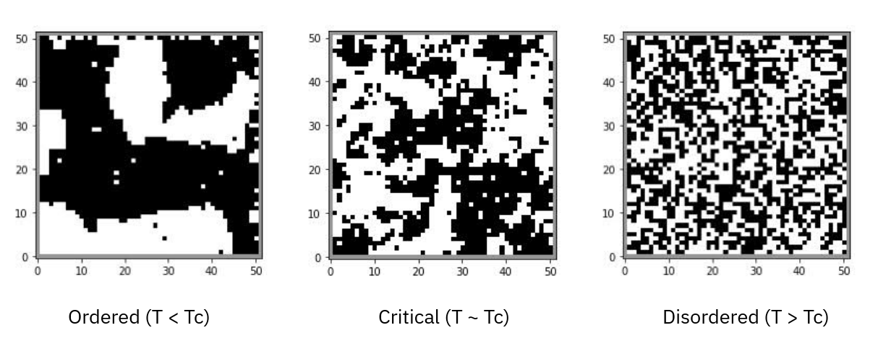
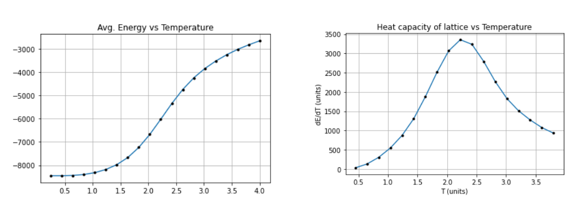
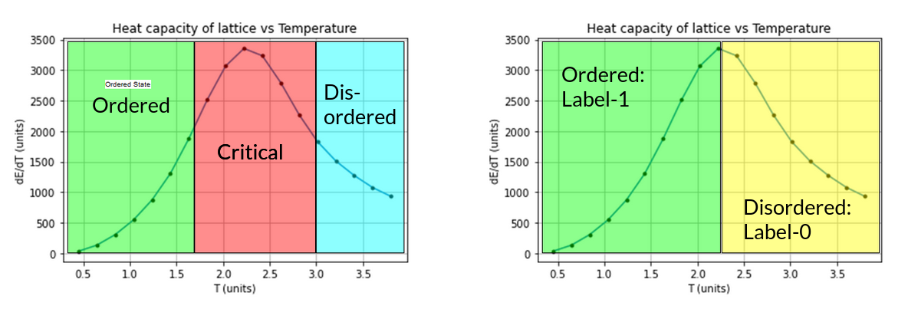
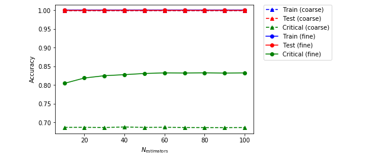
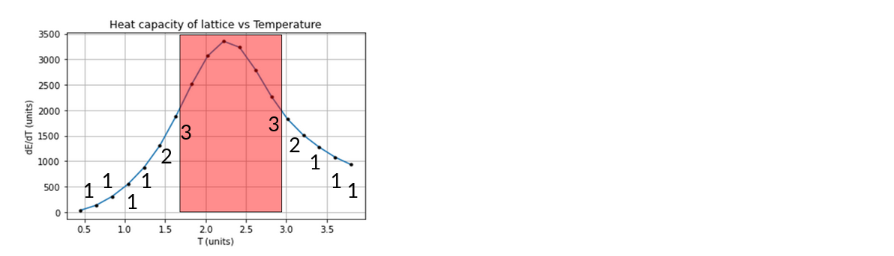
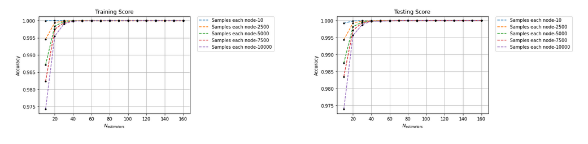
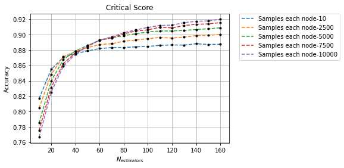

# Brief overview of the 1D Ising model

- The idea was to find the parameter quantifying interaction between neighbouring spins i.e. $J$.
- Previously in our 1D Ising spin model, we trained our model using linear regression and its variants (Ridge, Lasso).
- Comparison between linear regression and the advantages introduced by Ridge, Lasso regression were discussed.
- In addition, we implemented our training using 2$^{nd}$ nearest neighbour interaction to see if the regression models still worked. Ridge regression gave pretty good results.

\begin{equation}
    H = \sum_{\langle i, j \rangle} -J \sigma_i \sigma_j
\end{equation}

# Premise to investigating 2D Ising model

# Analysis of the metropolis data for 2D Ising model

- We generated using Monte-Carlo methods, 10,000 lattices for a range of 20 different temperatures (0.25-4) units.
- Tabulation of energy and heat capacity as a function of temperature (averaged over all 10,000 lattices) to verify the reliability of the generated data in accordance with statistical physics.

# Labelling data before supervised learning

We proceed to find the critical temperature beyond which these lattices become disordered. Theoretically shown by Onsager _et al._ the critical temperature is given by

$$
T_c = J / \log (1 + \sqrt{2}) \approx 2.26
$$

We then split the data into critical and ordered/disordered sets since we expect that identifying the type of orderness of the lattices to be hard in the neighbouring vicinity of the critical point.

# Vicinity of critical temperature

# Random Forests: the way to go?

- Our lattices are Monte-Carlo generated where our predictions are usually correlated. Thus weak classifiers such as decision trees and averaging several such models reduces the risk of choosing the wrong model (lowering the overall variance and bias).
- Ensemble methods such as RF also reduces the risk of our model to rely on some greedy assumption or local search that may get stuck in a local extrema (quite common in Monte-Carlo data such as ours) and generate a better performant model.

# Implementation of RF

- We train our ordered and disordered datasets using the RF classifier scheme.
- However, the critical data samples are **not** trained since we use it as a certificate to verify the reliability of our model when classifying between ordered and disordered phases in the critical regime.
- Two hyperparameters of significance that we tinker with are:
    - `n_estimators` i.e. number of decision trees in our forest.
    - `min_samples_split` i.e. the leaf size at each node.

- In our code, we compared course trees (`min_samples_split` = 10000) and fine trees (`min_samples_split` = 2).

# Results from Mehta _et al._

Vanilla RF gave an accuracy of 69.2% (nice) for course trees compared to an accuracy score of 83.1% for fine trees at 100 estimators each.

# Transductive approach - improvement to RF

- In our original model implemented using vanilla RF, it provides equal importance (weightage) to all the ordered and disordered lattices to decide the hierarchy of the features in the decision trees.
- Giving more weightage to lattice datapoints closer to the critical temperature over the ones far from it lets the model pick more prominent features in these lattices. It also lowers the priority of features present in completely ordered/disordered lattices since they don't play as important of a role as the lattices that are in the neighbourhood of the critical point.

# Implementation of this weighted approach

We simply cloned (duplicated) lattice Ising data which were closer to this critical temperature in order to increase the weights of these datapoints as compared to the datapoints that were not cloned.

# Results

The results show an increase in the accuracy of the classification of critical samples compared to vanilla RF. Interestingly, by emphasising on samples closer to critical temperature $T_c$, the our altered version of RF works better for coarse trees (92.0%) then fine ones (88.75%). A reason for this might be due to the fact that our implementation of RF identified many features in the critical samples that made it effect in larger leaf sizes than smaller ones.

# Results (continued)

# Conclusion

- Our modified random forests is an effective algorithm in classifying our lattices in the critical region (and in other regions) with efficiency best at leaf size: 1000 with large estimators. However, this comes at a cost of the algorithm being computationally expensive with a runtime ~ 90-170 seconds.
- The accuracy obtained is comparable to the CNN algorithm implemented in Mehta _et al._ (~ 88-92%).

# Limitations and future work

- We however, need good analytical answers for our material in order to implement this algorithm and it demands us to know the critical temperature of the material beforehand (since we are using supervised learning) and we manually need to assign labels for ordered/disordered lattices to get a well-trained model.
- We hope to work in using an unsupervised approach that is a "generative" instead of a "discriminative" model in the future. These models are capable of generating a new critical phase lattice from the information of lattices we have in our data. This is achieved using restricted Boltzmann machines and deep Boltzmann machines.[^1]

[^1]: Salakhutdinov, Ruslan, and Geoffrey Hinton. "Deep boltzmann machines." Artificial intelligence and statistics. PMLR, 2009.

# Bibliography

1. Mehta, P., Bukov, M., Wang, C. H., Day, A. G., Richardson, C., Fisher, C. K., & Schwab, D. J. (2019). A high-bias, low-variance introduction to machine learning for physicists. Physics reports, 810, 1-124.

2. Morningstar, Alan, and Roger G. Melko. "Deep learning the ising model near criticality." arXiv preprint arXiv:1708.04622 (2017).

2. Majumdar, Chanchal K. "Analytic properties of the onsager solution of the Ising model." Physical Review 145.1 (1966): 158.

3. Nelson, James, and Stefano Sanvito. "Predicting the Curie temperature of ferromagnets using machine learning." Physical Review Materials 3.10 (2019): 104405.

4. Alpaydin, E. (2020). Introduction to machine learning. MIT press.
